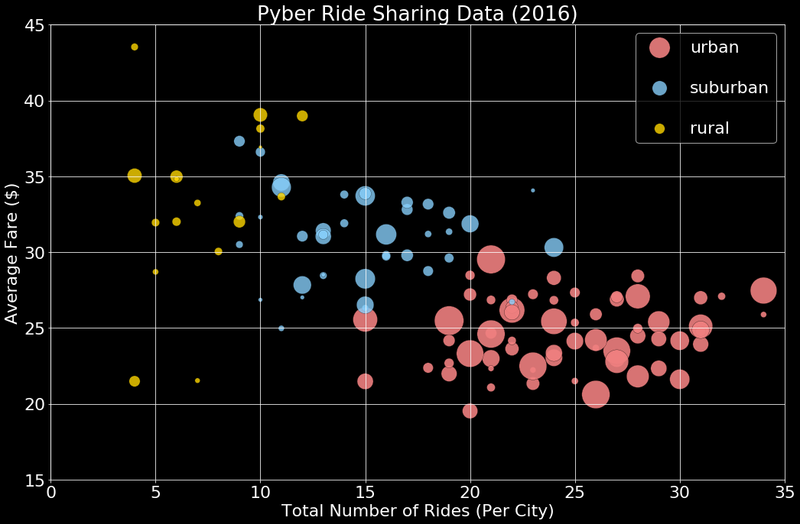

# Pyber Ride Sharing

Analysis: 
* Observed Trend 1: The average fares of rural areas are more spead out than urban and suburban areas.
* Observed Trend 2: The amount of total fares, toal rides, and total drivers are bigger in urban cities than rural and suburban ones.
* Observed Trend 3: The amount of total fares, toal rides, and total drivers are bigger in suburban cities than rural ones.


```python
# Import dependencies
%matplotlib inline
import pylab
import matplotlib
import matplotlib.pyplot as plt
import pandas as pd
import numpy as np
from matplotlib import rcParams

# Read csv files
city_df = pd.read_csv("raw_data/city_data.csv")
ride_df = pd.read_csv("raw_data/ride_data.csv")
```


```python
# Merge dataframes
df = pd.merge(left=ride_df, right=city_df, on="city", how="outer")
df.head()
```


<div>
<style scoped>
    .dataframe tbody tr th:only-of-type {
        vertical-align: middle;
    }

    .dataframe tbody tr th {
        vertical-align: top;
    }

    .dataframe thead th {
        text-align: right;
    }
</style>
<table border="1" class="dataframe">
  <thead>
    <tr style="text-align: right;">
      <th></th>
      <th>city</th>
      <th>date</th>
      <th>fare</th>
      <th>ride_id</th>
      <th>driver_count</th>
      <th>type</th>
    </tr>
  </thead>
  <tbody>
    <tr>
      <th>0</th>
      <td>Sarabury</td>
      <td>2016-01-16 13:49:27</td>
      <td>38.35</td>
      <td>5403689035038</td>
      <td>46</td>
      <td>Urban</td>
    </tr>
    <tr>
      <th>1</th>
      <td>Sarabury</td>
      <td>2016-07-23 07:42:44</td>
      <td>21.76</td>
      <td>7546681945283</td>
      <td>46</td>
      <td>Urban</td>
    </tr>
    <tr>
      <th>2</th>
      <td>Sarabury</td>
      <td>2016-04-02 04:32:25</td>
      <td>38.03</td>
      <td>4932495851866</td>
      <td>46</td>
      <td>Urban</td>
    </tr>
    <tr>
      <th>3</th>
      <td>Sarabury</td>
      <td>2016-06-23 05:03:41</td>
      <td>26.82</td>
      <td>6711035373406</td>
      <td>46</td>
      <td>Urban</td>
    </tr>
    <tr>
      <th>4</th>
      <td>Sarabury</td>
      <td>2016-09-30 12:48:34</td>
      <td>30.30</td>
      <td>6388737278232</td>
      <td>46</td>
      <td>Urban</td>
    </tr>
  </tbody>
</table>
</div>


# Bubble Plot of Ride Sharing Data


```python
# Using groupby to get data series
df_group = df.groupby("city")
cities = df["city"].value_counts()
total_drivers = df_group["driver_count"].mean()
city_type = df_group["type"].max()
average_fare = df_group["fare"].mean()
total_rides = df_group["ride_id"].count()
```


```python
# Create a dataframe for plotting
bubble_df = pd.DataFrame(
{
    "cities" : cities,
    "average_fare" : average_fare,
    "total_rides": total_rides,
    "total_drivers" : total_drivers,
    "city_type" : city_type,
})
bubble_df.head()
```


<div>
<style scoped>
    .dataframe tbody tr th:only-of-type {
        vertical-align: middle;
    }

    .dataframe tbody tr th {
        vertical-align: top;
    }

    .dataframe thead th {
        text-align: right;
    }
</style>
<table border="1" class="dataframe">
  <thead>
    <tr style="text-align: right;">
      <th></th>
      <th>average_fare</th>
      <th>cities</th>
      <th>city_type</th>
      <th>total_drivers</th>
      <th>total_rides</th>
    </tr>
  </thead>
  <tbody>
    <tr>
      <th>Alvarezhaven</th>
      <td>23.928710</td>
      <td>31</td>
      <td>Urban</td>
      <td>21</td>
      <td>31</td>
    </tr>
    <tr>
      <th>Alyssaberg</th>
      <td>20.609615</td>
      <td>26</td>
      <td>Urban</td>
      <td>67</td>
      <td>26</td>
    </tr>
    <tr>
      <th>Anitamouth</th>
      <td>37.315556</td>
      <td>9</td>
      <td>Suburban</td>
      <td>16</td>
      <td>9</td>
    </tr>
    <tr>
      <th>Antoniomouth</th>
      <td>23.625000</td>
      <td>22</td>
      <td>Urban</td>
      <td>21</td>
      <td>22</td>
    </tr>
    <tr>
      <th>Aprilchester</th>
      <td>21.981579</td>
      <td>19</td>
      <td>Urban</td>
      <td>49</td>
      <td>19</td>
    </tr>
  </tbody>
</table>
</div>


```python
# Prepare data series for plotting
urban = bubble_df[bubble_df["city_type"]=="Urban"]
suburban = bubble_df[bubble_df["city_type"]=="Suburban"]
rural = bubble_df[bubble_df["city_type"]=="Rural"]
```


```python
# Scatter plot
plt.style.use("dark_background")
matplotlib.rcParams.update({'font.size': 22})
ax = urban.plot(kind="scatter", x="total_rides", y="average_fare", figsize=(15,10), alpha=.9, edgecolor="k", linewidth=0.3, s=total_drivers*20, color="lightcoral", label="urban");
suburban.plot(kind="scatter", x="total_rides", y="average_fare", alpha=.8, edgecolor="k", linewidth=0.3, s=total_drivers*10, color="lightskyblue", label="suburban", ax=ax);
rural.plot(kind="scatter", x="total_rides", y="average_fare", alpha=.8, edgecolor="k", linewidth=0.3, s=total_drivers*5, color="gold", label="rural", ax=ax);

# Set style
plt.grid()
plt.legend(labelspacing=1.5)

# Set x limt and y limit
plt.xlim(0, 35)
plt.ylim(15, 45)

# Set title, x label, and y label style
plt.title("Pyber Ride Sharing Data (2016)")
plt.xlabel("Total Number of Rides (Per City)")
plt.ylabel("Average Fare ($)")
plt.tight_layout()
plt.show()
```





# Total Fares by City Type


```python
# Create a pie chart based upon total fares by city type
fare_pie = df.groupby("type").sum()
explode = (0, 0, 0.05)
colors = ["gold", "lightskyblue", "lightcoral"]
fare_pie.plot(kind="pie", y="fare", figsize=(10,8), legend=False, title="% of Total Fares by City Type", explode=explode, autopct="%1.1f%%", shadow=True, startangle=120, colors=colors)
pylab.ylabel('')
plt.show()
```


# Total Rides by City Type


```python
# Create a pie chart based upon total rides by city type
rides_pie = df.groupby("type").count()
explode = (0, 0, 0.05)
colors = ["gold", "lightskyblue", "lightcoral"]
rides_pie.plot(kind="pie", y="ride_id", figsize=(10,8), legend=False, title="% of Total Rides by City Type",\
               explode=explode, autopct="%1.1f%%", shadow=True,\
               startangle=120, colors=colors)
pylab.ylabel('')
```


    Text(0,0.5,'')


# Total Drivers by City Type


```python
# Create a pie chart based upon total drivers by city type
drivers_pie = city_df.groupby("type").sum()
drivers_pie
explode = (0, 0, 0.05)
colors = ["gold", "lightskyblue", "lightcoral"]
drivers_pie.plot(kind="pie", y="driver_count", figsize=(10,8), legend=False, title="% of Total Drivers by City Type",\
                 explode=explode, autopct="%1.1f%%", shadow=True,\
                 startangle=120, colors=colors)
pylab.ylabel('')
```


    Text(0,0.5,'')


